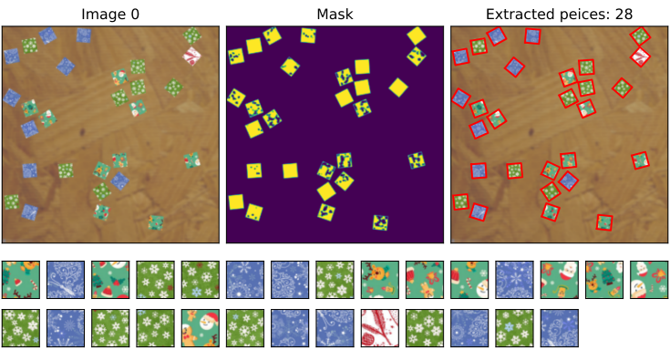
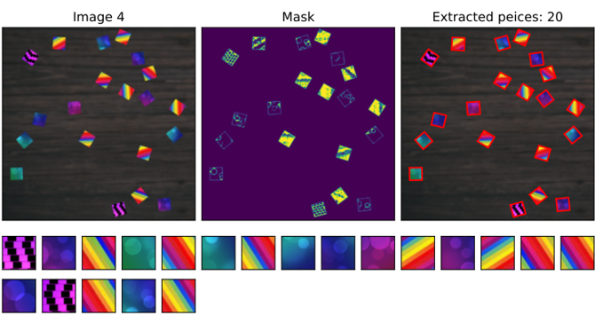
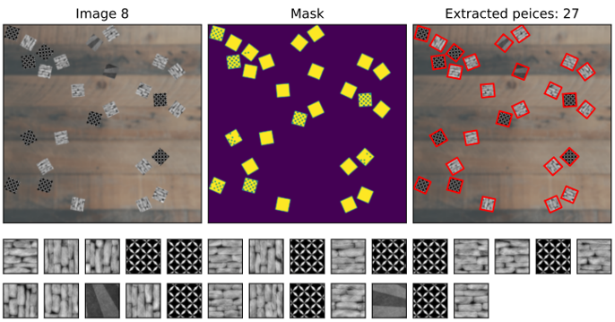

# Image Analysis and Pattern Recognition

This is the repository for projects in the course [Image Analysis and Pattern Recognition](https://edu.epfl.ch/coursebook/en/image-analysis-and-pattern-recognition-EE-451) at EPFL.

The final project is in the folder project and summarizes techniques learned in the course. Preprosessing, object extraction, feature extraction and clustering were used in this project to go from an image with randomly positioned puzzle pieces to organizing them together.

1. Extracting puzzle pieces useing preprocessing and Laplacian of image:

  
  
  

